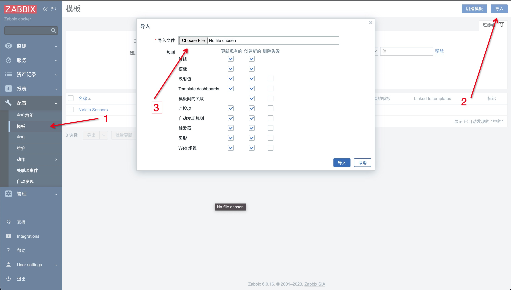
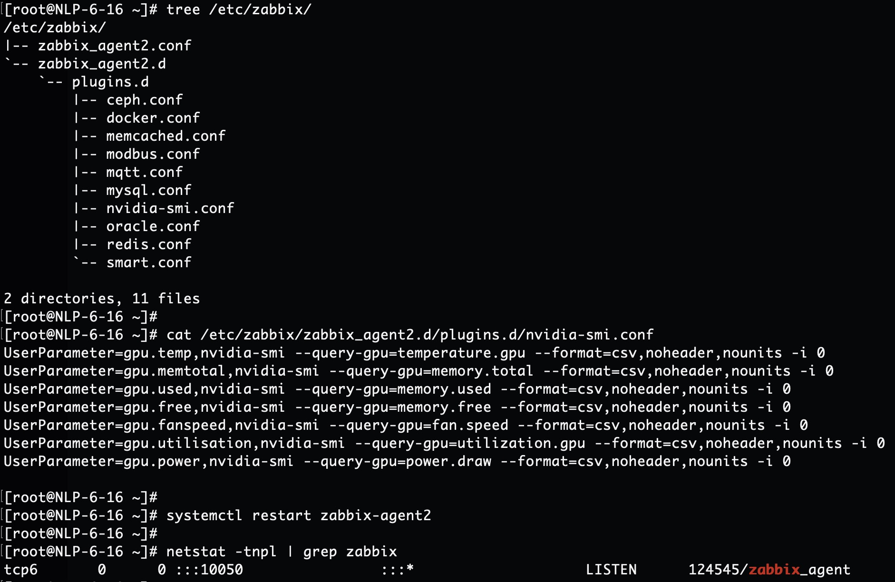

# Zabbix 离线安装

先在一台机器安装 Server，然后在其他机器安装 Agent

- Zabbix Server 版本：6.0.16
- Zabbix Agent2 版本：6.4.2
- Grafana 版本：9.5.1
- Docker 版本：23.0.4
- DockerCompose 版本：1.23.2
- 系统版本：Centos 6* / Centos 7* / Rocky 8*

*****

## 前提

1. 从公司云盘下载软件包 zabbix-parcels.6.0.16.20230508.tar.gz 到脚本执行机器中。
- http://119.254.145.21:12225/owncloud/index.php/s/7csixr73eOy5Ihg
- 如果网盘链接失效，去网盘目录下找该包：03-大数据/02-Zabbix/zabbix-parcels.6.0.16.20230508.tar.gz

2. 把压缩包解压到 /opt 目录下
```bash
wget -O /opt/zabbix-parcels.6.0.16.20230508.tar.gz http://119.254.145.21:12225/owncloud/index.php/s/7csixr73eOy5Ihg/download
tar -zxvf /opt/zabbix-parcels.6.0.16.20230508.tar.gz -C /opt/
```

*****

## 一、Zabbix 安装

### 0. 配置环境变量
- 需要手动补充该文件中的配置项
- [./00_env](./00_env)

### 1. 配置集群间ssh免密
- 需要修改 `config/vm_info` 文件
- [./01_sshpass.sh](./01_sshpass.sh)

### 2. 配置所有节点的 hosts
- 需要修改 `config/hosts` 文件
- [./02_hosts.sh](./02_hosts.sh)

### 3. 初始化系统环境
- [./03_init.sh](./03_init.sh)

### 4. 安装 Docker 和 Docker Compose
- [./04_docker.sh](./04_docker.sh)

### 5. 安装 Zabbix Server
- [./05_zabbix_server.sh](./05_zabbix_server.sh)

### 6. 安装 Zabbix Agent
- [./06_zabbix_agent.sh](./06_zabbix_agent.sh)

## 二、Zabbix 添加监控模版

非常简单，只有两步，比把大象装进冰箱少一步。

### 1. 在 zabbix server 端导入模版

- "配置" -> "模版" -> "导入"



### 2. 在 zabbix agent 端配置指标采集

- vim /etc/zabbix/zabbix_agent2.d/plugins.d/nvidia-smi.conf
- systemctl restart zabbix-agent2




*****

## 其它：
### 1. docker 镜像导出
```bash
docker save --output mysql.8.0.33.tar mysql:8.0.33
docker save --output zabbix-web-nginx-mysql.6.0.16-centos.tar zabbix/zabbix-web-nginx-mysql:6.0.16-centos
docker save --output zabbix-server-mysql.6.0.16-centos.tar zabbix/zabbix-server-mysql:6.0.16-centos
docker save --output zabbix-java-gateway.6.0.16-centos.tar zabbix/zabbix-java-gateway:6.0.16-centos
docker save --output zabbix-agent.6.0.16-centos.tar zabbix/zabbix-agent:6.0.16-centos
docker save --output grafana.9.5.1.tar grafana/grafana:9.5.1

tar -zcvf mysql.8.0.33.tar.gz mysql.8.0.33.tar
tar -zcvf zabbix-web-nginx-mysql.6.0.16-centos.tar.gz zabbix-web-nginx-mysql.6.0.16-centos.tar
tar -zcvf zabbix-server-mysql.6.0.16-centos.tar.gz zabbix-server-mysql.6.0.16-centos.tar
tar -zcvf zabbix-java-gateway.6.0.16-centos.tar.gz zabbix-java-gateway.6.0.16-centos.tar
tar -zcvf zabbix-agent.6.0.16-centos.tar.gz zabbix-agent.6.0.16-centos.tar
tar -zcvf grafana.9.5.1.tar.gz grafana.9.5.1.tar

mv mysql.8.0.33.tar.gz /opt/zabbix-parcels
mv zabbix-web-nginx-mysql.6.0.16-centos.tar.gz /opt/zabbix-parcels
mv zabbix-server-mysql.6.0.16-centos.tar.gz /opt/zabbix-parcels
mv zabbix-java-gateway.6.0.16-centos.tar.gz /opt/zabbix-parcels
mv zabbix-agent.6.0.16-centos.tar.gz /opt/zabbix-parcels
mv grafana.9.5.1.tar.gz /opt/zabbix-parcels
```

### 2. docker 镜像导入
```bash
tar -zxvf /opt/zabbix-parcels/mysql.8.0.33.tar.gz -C /tmp/
tar -zxvf /opt/zabbix-parcels/zabbix-web-nginx-mysql.6.0.16-centos.tar.gz -C /tmp/
tar -zxvf /opt/zabbix-parcels/zabbix-server-mysql.6.0.16-centos.tar.gz -C /tmp/
tar -zxvf /opt/zabbix-parcels/zabbix-java-gateway.6.0.16-centos.tar.gz -C /tmp/
tar -zxvf /opt/zabbix-parcels/zabbix-agent.6.0.16-centos.tar.gz -C /tmp/
tar -zxvf /opt/zabbix-parcels/grafana.9.5.1.tar.gz -C /tmp/

docker load -i /tmp/mysql.8.0.33.tar
docker load -i /tmp/zabbix-web-nginx-mysql.6.0.16-centos.tar
docker load -i /tmp/zabbix-server-mysql.6.0.16-centos.tar
docker load -i /tmp/zabbix-java-gateway.6.0.16-centos.tar
docker load -i /tmp/zabbix-agent.6.0.16-centos.tar
docker load -i /tmp/grafana.9.5.1.tar
```

### 3. zabbix 地址
```bash
http://10.0.1.66:8080/
Admin
zabbix
```

### 4. grafana 配置 zabbix
- zabbix api: http://10.0.0.155:8080/api_jsonrpc.php
- grafana web: http://10.0.1.67:3000/d/zabbix/all-server-status
```bash
管理员账号：
admin
admin
只读账号：
readonly
readonly
```


## Refs:
- Docker离线安装：https://www.cnblogs.com/xiongzaiqiren/p/16900429.html
- Docker compose 安装 zabbix： https://juejin.cn/post/7085020149761179661
- Centos6 RPMS: http://bay.uchicago.edu/centos-vault/centos/6.10/os/x86_64/Packages/
- Centos7/8 RPMS: https://centos.pkgs.org/
- 官方社区模版库：https://github.com/zabbix/community-templates/