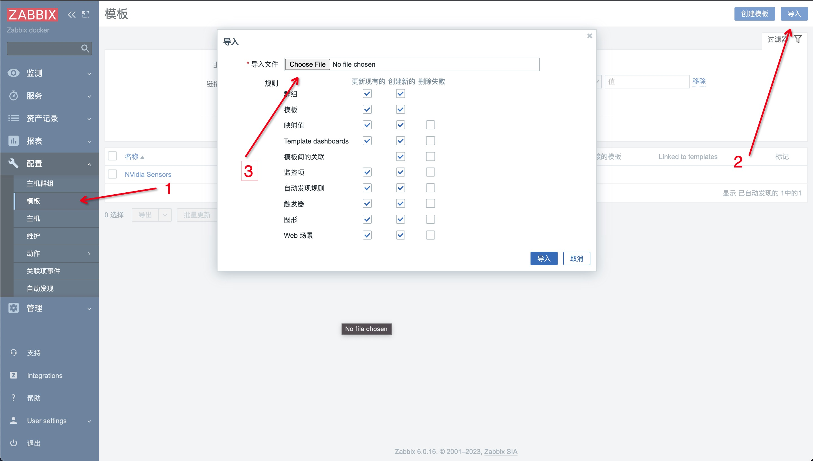
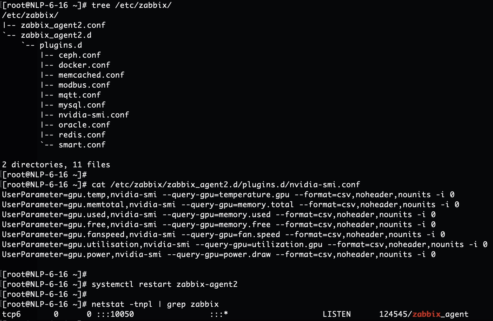

## Zabbix Tempaltes

zabbix 的监控模版

### 使用说明

非常简单，只有两步，比把大象装进冰箱少一步。

1. 在 zabbix server 端导入模版

- "配置" -> "模版" -> "导入"

2. 在 zabbix agent 端配置指标采集

- vim /etc/zabbix/zabbix_agent2.d/plugins.d/nvidia-smi.conf
- systemctl restart zabbix-agent2

### Refs：
1. 官方社区模版库：https://github.com/zabbix/community-templates/
